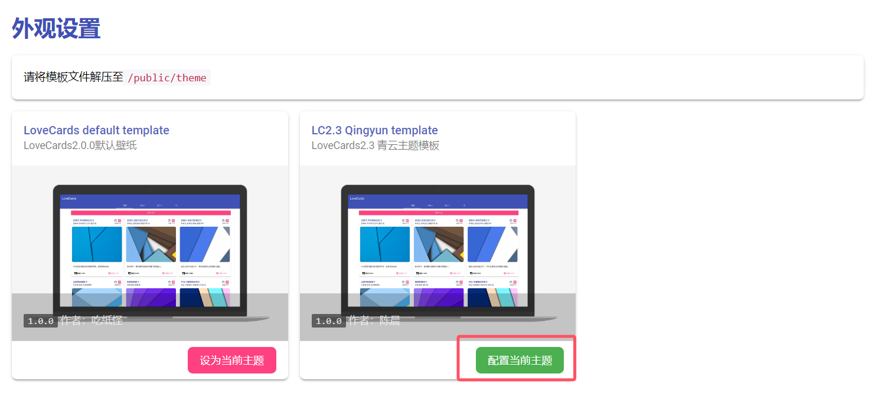
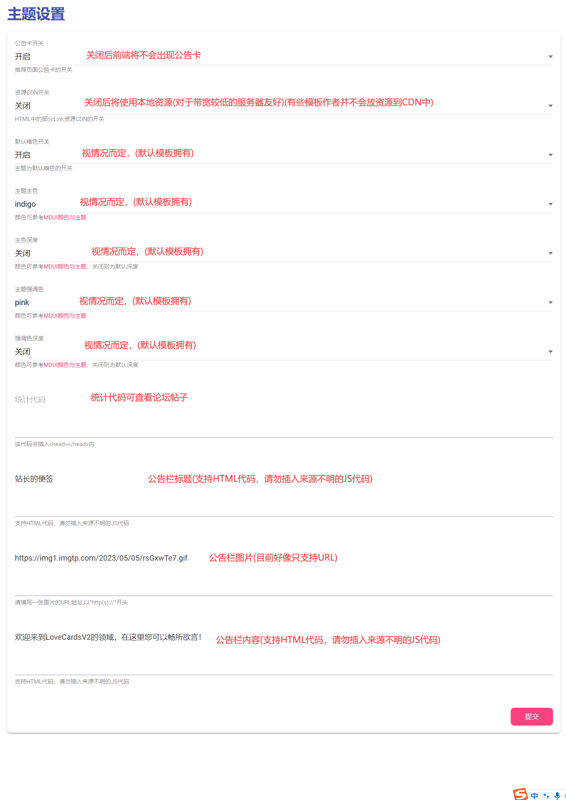
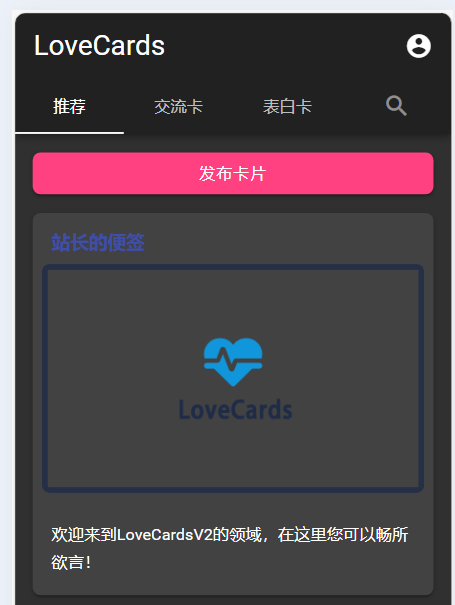

# LoveCards主题 设置指南

::: tip 内容源自
作者：Cheney 
Email：1969947820@qq.com  
适用版本：2.2 - 2.3
:::

## 进入设置

>在外观设置中找到 [配置当前主题] 按钮并点击
> 

### 设置

>如图所示进行设置

> 注：  每个模板的设置内容都不一样，具体请参考模板作者提供的教程 (本教程以默认主题演示)

>按照默认设置会得到如下效果

### 其他
>关于统计代码

- [青闻流量统计](https://forum.lovecards.cn/d/77)
- [Matomo](https://forum.lovecards.cn/d/2)