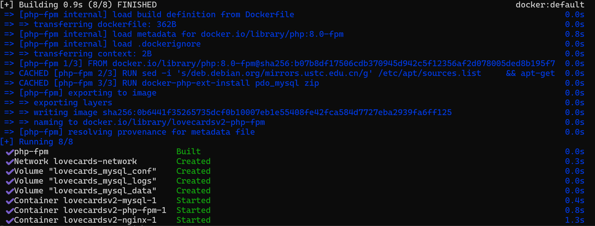
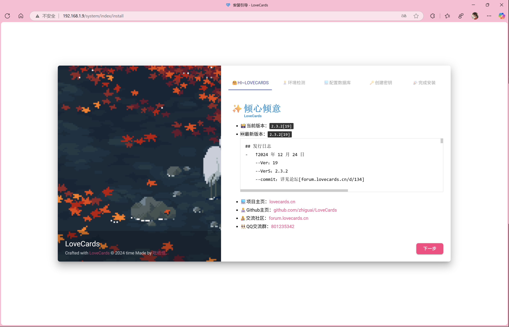
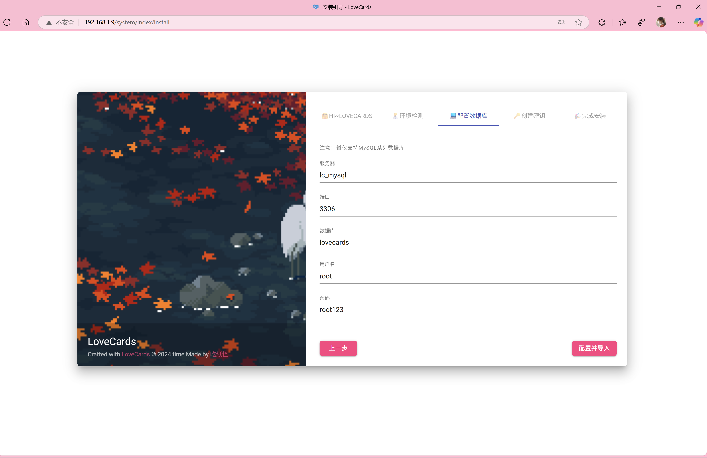
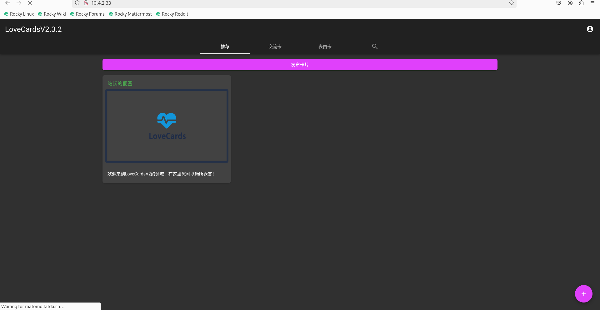
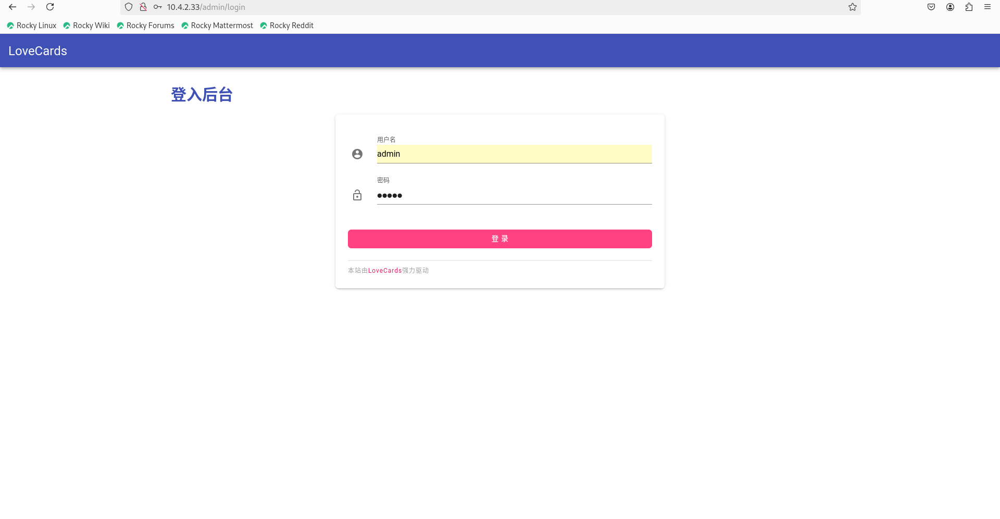

# 💌 LoveCardsV2 Docker 部署指南

本指南将帮助您通过 Docker 快速部署 LoveCardsV2 项目，实现一键启动、服务隔离、快速上线。

---
> 作者：Cg8-5712 \
> 最后更新日期：2025 年 5 月 12 日
---

## 📚 目录

1. [环境要求](#环境要求)
2. [准备 Docker 环境](#准备-docker-环境)
3. [文件结构](#文件结构)
4. [部署步骤](#部署步骤)
5. [服务说明](#服务说明)
6. [常见问题](#常见问题)
7. [作者信息](#作者信息)

---

## 🪰 环境要求

请确保您的系统满足以下条件：

* 已安装 [Docker](https://docs.docker.com/get-docker/)
* 已安装 [Docker Compose](https://docs.docker.com/compose/install/)
* 基本的 Linux 命令行操作能力

---

## 🛠️ 准备 Docker 环境

如您的系统尚未安装 Docker，可按以下步骤安装并配置：

```bash
# 一键安装 Docker
curl -fsSL https://get.docker.com | sudo sh

# 启动并设置开机自启
sudo systemctl start docker
sudo systemctl enable docker
sudo systemctl status docker

# 测试 Docker 安装是否成功
sudo docker run hello-world
```

如果您看到 `Hello from Docker!` 的欢迎信息，则说明安装成功。

### 设置国内加速镜像（推荐）

```bash
sudo mkdir -p /etc/docker

sudo tee /etc/docker/daemon.json <<-'EOF'
{
    "registry-mirrors": [
        "https://docker.1ms.run",
        "https://docker-0.unsee.tech",
        "https://docker.hlmirror.com",
        "https://func.ink",
        "https://lispy.org"
    ]
}
EOF

# 应用配置（必须执行）
sudo systemctl daemon-reload
sudo systemctl restart docker
```

---

## 📁 文件结构

项目主要目录结构如下：

```
lovecards/
├── LoveCardsV2/
│   ├── docker/
│   │   └── nginx.conf
│   ├── docker-compose.yml
│   ├── Dockerfile
│   └── ···
└── mysql/
   ├── data/
   ├── conf/
   └── logs/
```

快速创建上述目录结构：

```bash
mkdir -p lovecards/mysql/{data,conf,logs}
```

---

## 🚀 部署步骤

### 1️⃣ 克隆项目代码

```bash
wget https://github.com/LoveCards/LoveCardsV2/releases/download/v2.3.2/LoveCards-v2.3.2.zip
unzip LoveCards-v2.3.2.zip
cd LoveCardsV2

git clone https://github.com/LoveCards/LoveCardsV2.git

sudo mv LoveCardsV2/Dockerfile lovecards/LoveCardsV2/
sudo mv LoveCardsV2/docker-compose.yaml lovecards/LoveCardsV2/
sudo mv LoveCardsV2/docker/nginx.conf lovecards/LoveCardsV2/
```

### 2️⃣ 创建 Docker 网络

如果未创建 `lovecards-network` 网络，请执行：

```bash
docker network create lovecards-network
```

### 3️⃣ 启动服务
可自行编辑 `docker-compose.yaml` 文件，修改数据库密码 \
推荐使用`tr -cd 'a-zA-Z0-9[]{}#$%^&*+_=-' < /dev/urandom | head -c32` 生成

```bash
docker compose up --build -d
```

完成后，您将看到类似以下的输出：



### 4️⃣ 检查服务状态

```bash
docker ps
```

您应能看到 nginx、php、mysql 等服务已启动对应的容器列表。

### 5️⃣ 访问应用

在浏览器中打开：

```
http://服务器ip
```

如部署成功，您将看到 LoveCardsV2 的安装引导页面。



### 6️⃣ 安装引导
请根据页面提示完成安装引导。
数据库配置如下：


---

成功后页面


> 初始管理员默认密码 `admin` \
> 密码采用 SHA1 加密， 可提前自行在 MySQL 中修改 

---

## 📦 服务说明

### 🔹 Nginx 服务

* **镜像**: `nginx:1.27.5-alpine`
* **配置文件**: `docker/nginx.conf`
* **端口映射**: `80:80`
* **作用**: 透过反向代理提供 Web 应用服务

---

### 🔹 PHP-FPM 服务

* **镜像**: 基于 `php:8.0-fpm` 构建
* **作用**: 执行 PHP 应用逻辑
* **端口**: `9000`

---

### 🔹 MySQL 服务

* **镜像**: `mysql:8.0`
* **环境变量**:

  * 数据库名: `lovecards`
  * 用户名: `root`
  * 密码: `root123`
* **数据卷映射**:

  * 数据目录: `../mysql/data`
  * 配置文件: `../mysql/conf`
  * 日志目录: `../mysql/logs`

---

## ❓ 常见问题

### 🔍 如何查看服务日志？

```bash
docker compose logs <服务名>
# 示例：
docker compose logs mysql
```

---

### ⛔ 如何停止服务？

```bash
docker compose down
```

---

### 🐛 数据库连接失败怎么办？

请检查：

* MySQL 容器是否正常运行
* `docker-compose.yml` 中环境变量是否配置正确
* `lovecards-network` 是否已被创建
* PHP 应用连接地址是否使用服务名 `mysql`

如果仍无效，请联系文档维护人 [5712.cg8@gmail.com](mailto:5712.cg8@gmail.com) 

---

## 📝 备注

### ✏️ 修改 PHP 配置

```bash
docker compose build --no-cache php
```

### ✏️ 修改 Nginx 配置

```bash
docker compose restart nginx
```

---

## 👤 作者信息

* 🌐 **项目地址**: [LoveCardsV2](https://github.com/LoveCards/LoveCardsV2)
* 👨‍💻 **文档维护人**: [Cg8-5712](https://github.com/cg8-5712)
* 📧 **联系邮箱**: [5712.cg8@gmail.com](mailto:5712.cg8@gmail.com)
* 🗓️ **最后更新日期**: 2025 年 5 月 12 日

---
