# 虚拟主机 部署指南
虚拟主机推荐您使用汉堡云IDC，LoveCard唯一指定服务商！

虚拟主机低至2.88每月，购买链接：https://hbyidc.com/recommend/4ai5youo0mTC

使用汉堡云IDC的虚拟主机，您可以一键部署LoveCard2.3.0版本，点击按钮，1分钟自动部署！

新增！视频教程：https://www.bilibili.com/video/BV14zWkeSED1/?spm_id_from=333.999.0.0

## 【推荐】一键部署教程
>虚拟主机一键部署汉堡云IDC独家！其他厂商虚拟主机请查看手动部署教程~

>虚拟主机低至2.88每月，购买链接：https://hbyidc.com/recommend/4ai5youo0mTC

开始部署

来到控制面板后在侧边栏找到一键部署，选择LoveCard2.3.0 点击确认部署 随后点击确定 等待15-30秒即可
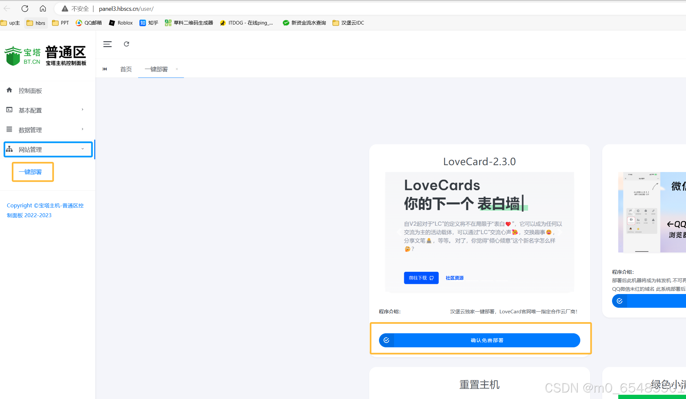

在基础配置的设置PHP版本中 选择PHP8.0 保存
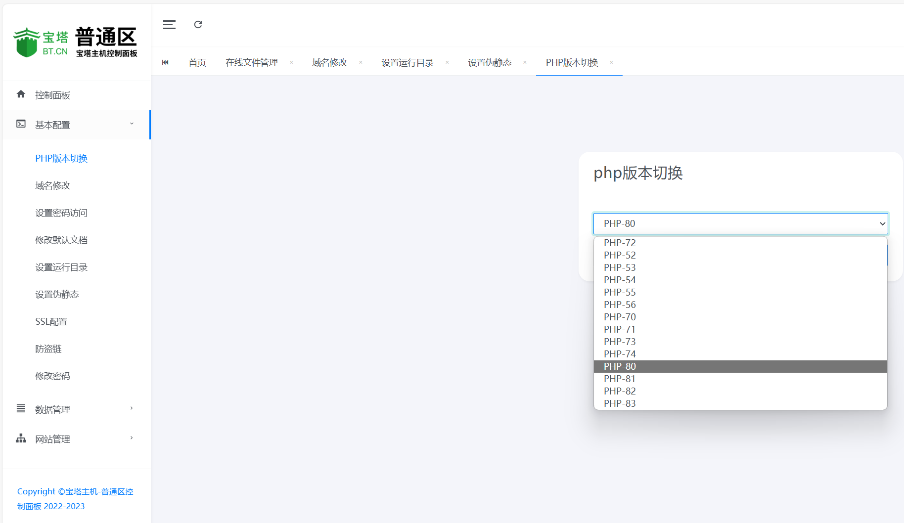

绑定域名（解析教程在这里就不多赘述了，大家可以百度或者询问客服），甩一个使用汉堡云二级域名的解析教程：https://bk.hbyidc.com/wz/505
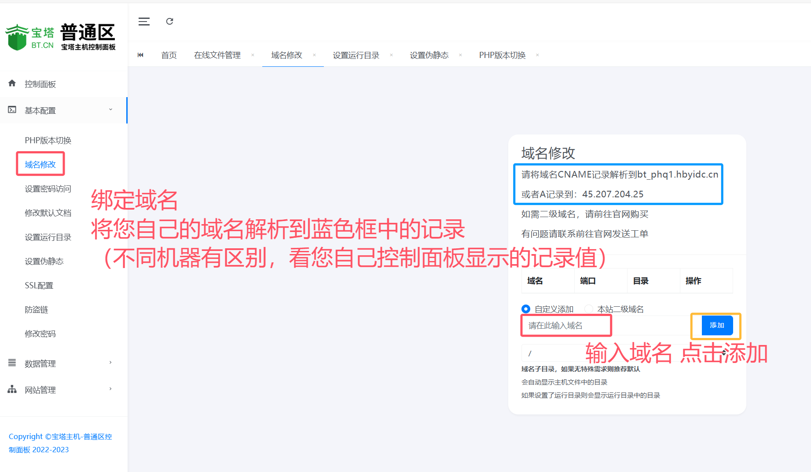

## 手动部署教程
> 本手动教程使用用所有“MN宝塔主机分销系统”的虚拟主机控制面板，覆盖市面上大多数IDC的控制面板！

> 如果您是汉堡云IDC虚拟主机强烈推荐使用一键部署！

首先，进入虚拟主机的控制面板
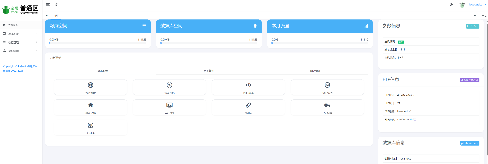

然后点击数据管理，再点击在线文件管理
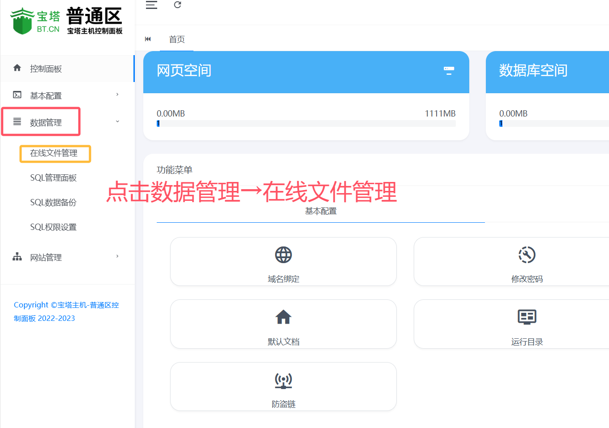

上传源码
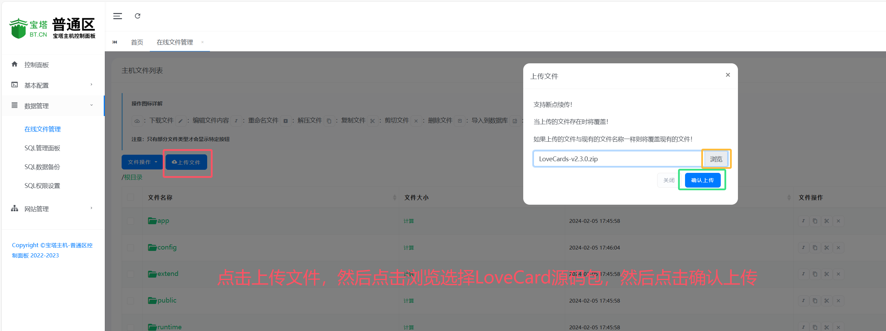

解压源码
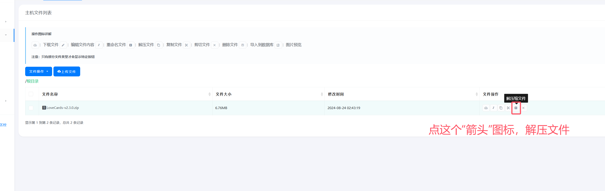

点击基本配置→设置运行目录→选择public，然后保存
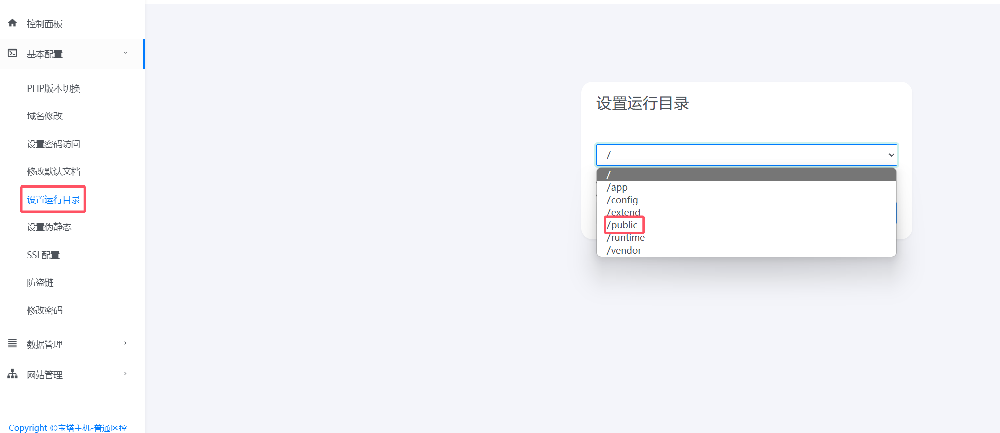

设置伪静态为“ThinkPHP”
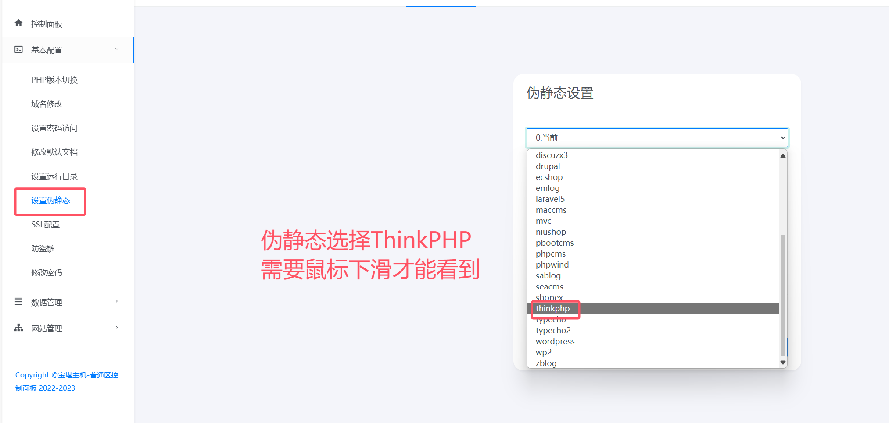

在基础配置的设置PHP版本中 选择PHP8.0 保存

绑定域名（解析教程在这里就不多赘述了），甩一个使用汉堡云二级域名的解析教程：https://docs.hbyidc.com/node/0197e378-6825-74ee-a495-9a0c53cc7785

恭喜您！！！控制面板的设置到此结束！
随后，请您打开域名开始安装 打开后无脑下一步即可
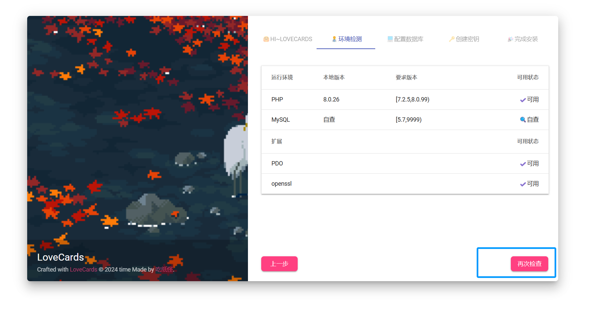

在数据库配置界面，一一根据控制面板的内容对应即可
安装界面的用户名/数据库 就是控制面板显示的数据库账号
安装界面的密码 就是控制面板显示的数据库密码
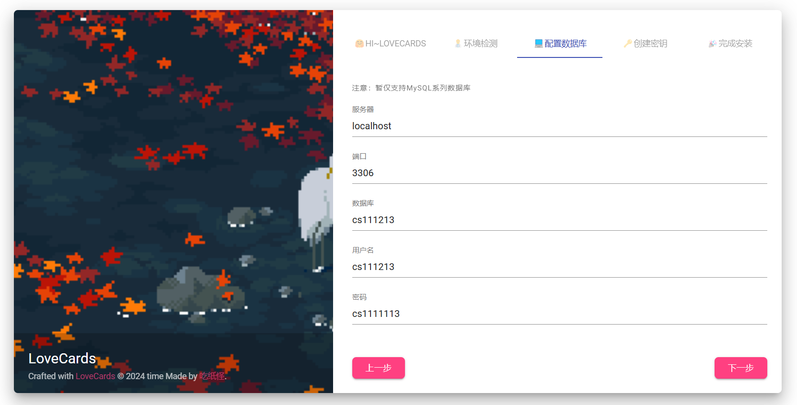

密钥这里 直接下一步即可
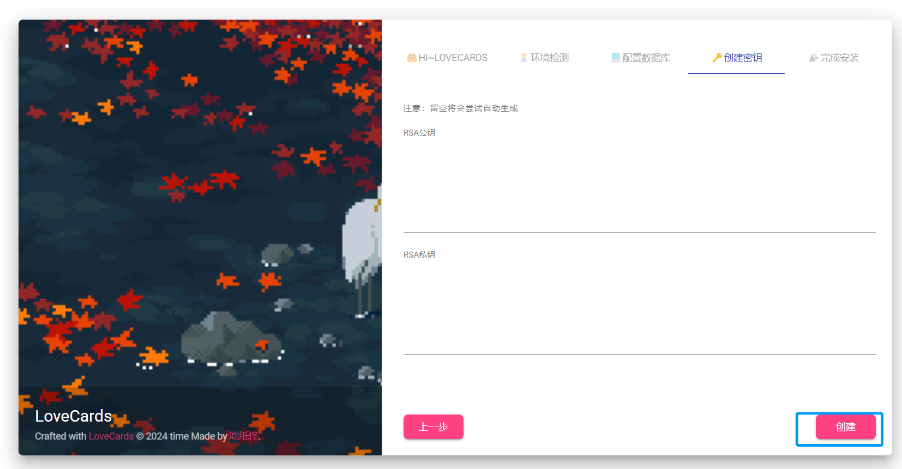

🎉恭喜您！大功告成！可喜可贺呢~🎉

LoveCards伴您而行..

> 以下是一些信息...

> 后台地址：您的域名/admin

> 超管账户：admin

> 超管密码：admin